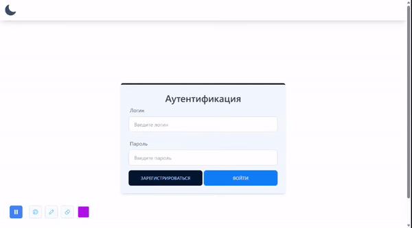
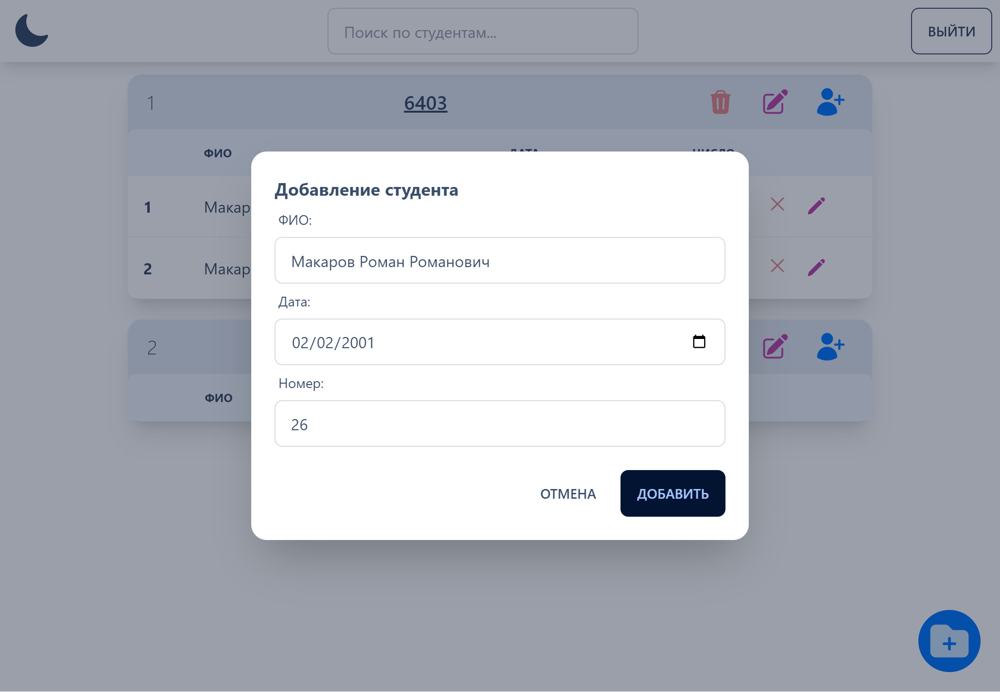
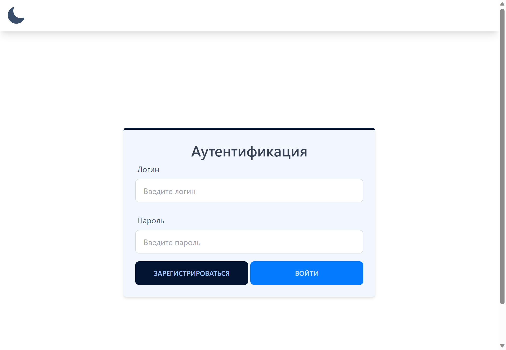
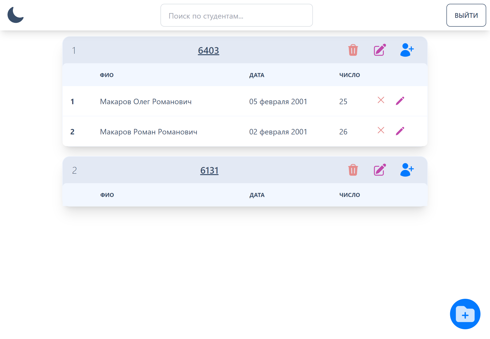
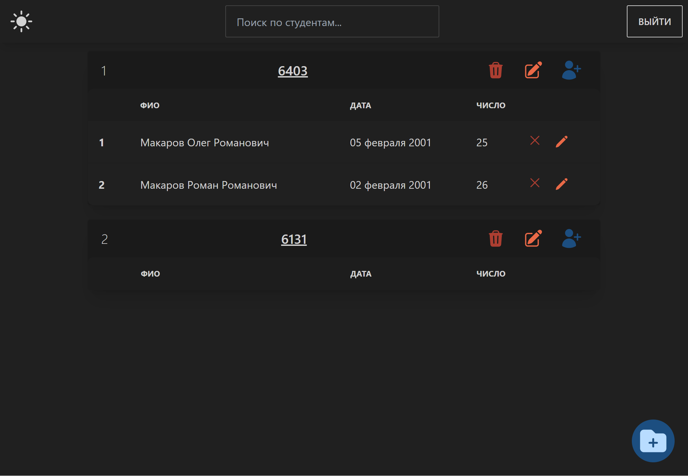

# Учет студентов
 CRUD приложение учета студентов в университете с возможностью поиска и аутенентификацией.
<p align="center">

</p>

## Возможности
⚡ Создание/Редактирование/Удаление групп

⚡ Создание/Редактирование/Удаление студентов

⚡ Поиск по группам и студентам

⚡ Аутенентификация, Авторизация и Регистрация пользователей

⚡ Basic auth + BCrypt

⚡ 2 роли: Администратор и пользователь

⚡ Темная/Светлая тема

 ## Скриншоты
<p align="center">
    
    
    
    
</p>

 ## Попробовать
[JRE](https://github.com/wracce/student-accounting/releases/tag/v0.0.1)

Для запуска (Поменяйте логин и пароль Postgres на свой):
```bash
java -jar study-0.0.1.jar  --spring.datasource.username=postgres --spring.datasource.password=5432
```


## Стек технологий
Frontend:
 * TypeScript
 * Angular
 * Tailwind / PostCSS / AutoPrefixer
 * DaisyUI / Angular Icons

 Backend: 
 * Java
 * Spring (Spr) / PostgreSQL
 * Spring Boot / Spring Security / Spring WEB

Методология: 
 * Prettier
 * BEM, SOLID

## Сборка / Запуск


1. Установка зависимостей

фронтенд:
```bash
npm install
```

бэкэнд:
```bash
mvn clean install
```

2. Сборка фронтенд части

```bash
ng build
```

3. Скопировать собранные файлы в папку static бэкэнда

4. Сборка бэкэнда
```bash
mvn compile
mvn package
```

5. Запуск проекта:
```bash
java -jar target/study-0.0.1-SNAPSHOOT.jar
```

## Лицензия
MIT license!
